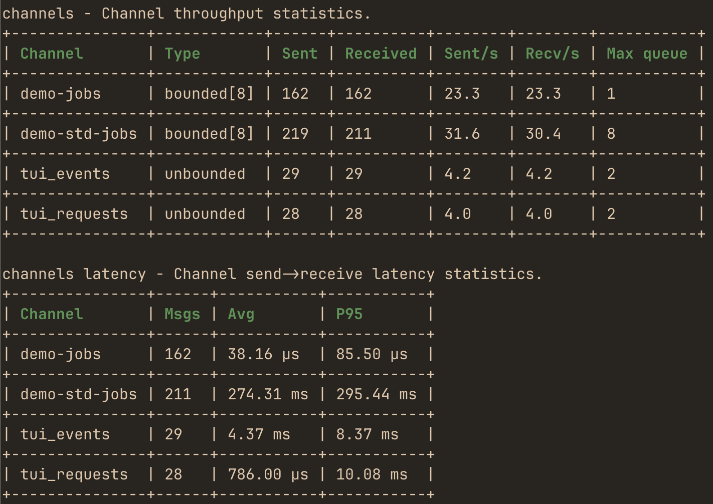
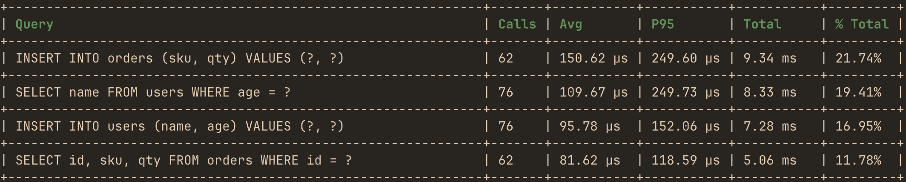

#  hotpath - Rust Performance, CPU & Memory Profiler
[](https://github.com/pawurb/hotpath/actions) [](https://crates.io/crates/hotpath) [](https://crates.io/crates/hotpath) [](https://hotpath.rs/sponsorship)

hotpath-rs is an easy-to-configure Rust performance profiler that shows exactly where your code spends time, burns CPU, and allocates memory. 

It helps you distinguish between functions that are slow because they wait on I/O and those that are CPU-intensive. Instrument functions, channels, futures, and streams to find bottlenecks and focus optimizations where they matter most. Get actionable insights into time, memory, and async data flow with minimal setup.

Try the TUI demo via SSH - no installation required:

```
ssh demo.hotpath.rs
```

Explore the full documentation at [hotpath.rs](https://hotpath.rs). See [CONTRIBUTING.md](CONTRIBUTING.md) for development setup and guidelines.

You can use it to produce one-off performance (timing, memory or CPU) reports:


monitor throughput, performance and max queue depth of instrumented channels:



analyze SQL calls performance:



or use the live TUI dashboard to monitor real-time performance metrics with debug info:

https://github.com/user-attachments/assets/2e890417-2b43-4b1b-8657-a5ef3b458153

## Features

- **Time, CPU & memory profiling** - identify expensive functions, allocation hotspots, and investigate memory leaks.
- **Async observability** - futures, channels and streams.
- **SQL query profiling** - query performance metrics for sqlx and Diesel.
- **Concurrency metrics** - Mutex/RwLock wait time and contention.
- **Tokio runtime monitoring** - workers, scheduling and queues.
- **Live TUI dashboard & static reports** - real-time or one-off analysis.
- **CI regression detection** - benchmark every PR automatically.
- **MCP server for AI agents** - query profiling data in real time.
- **Zero cost when disabled** - fully feature-gated.

## Current roadmap

- [x] [`hotpath::channel!/stream!/future!` events batching](https://github.com/pawurb/hotpath-rs/issues/345)
- [x] [`hotpath::mutex!/rw_lock!`](https://github.com/pawurb/hotpath-rs/issues/340)
- [x] `hotpath::channel!(..., wrap = true)` 
- [x] [`hotpath::channel!` timing histogram](https://github.com/pawurb/hotpath-rs/issues/299)
- [ ] [Instrument AsyncRead/AsyncWrite and Read/Write wrappers](https://github.com/pawurb/hotpath-rs/issues/379)
- [ ] `hotpath::sql!(...)` 
- [ ] `hotpath::http!(...)` 

## Getting Started

### Installation

Add to your `Cargo.toml`:

```toml
[dependencies]
hotpath = "0.21"

[features]
hotpath = ["hotpath/hotpath"]
hotpath-cpu = ["hotpath/hotpath-cpu"]
hotpath-alloc = ["hotpath/hotpath-alloc"]
```

This config ensures that the lib has no compile time or runtime overhead unless explicitly enabled via a `hotpath` feature. All the lib dependencies are optional (i.e. not compiled) and all macros are noop unless profiling is enabled.

### Basic setup

You'll need only `#[hotpath::main]` and `#[hotpath::measure]` macros to get started:

```rust
#[hotpath::measure]
fn sync_function(sleep: u64) {
    std::thread::sleep(Duration::from_nanos(sleep));
    let vec1 = vec![1, 2, 3];
    std::hint::black_box(&vec1); // force mem allocation
}

#[hotpath::measure]
async fn async_function(sleep: u64) {
    tokio::time::sleep(Duration::from_nanos(sleep)).await;
}

// When using with tokio, place the #[tokio::main] first
#[tokio::main]
#[hotpath::main]
async fn main() {
    for i in 0..10000 {
        sync_function(i);
        async_function(i * 2).await;

        hotpath::measure_block!("custom_block", {
            std::thread::sleep(Duration::from_nanos(i * 3))
        });
    }
}
```

Now, run your program with `hotpath` (and optionally `hotpath-alloc` features):

```bash
cargo run --features='hotpath,hotpath-alloc'
```

On exit it will print a report with timings, memory allocations and thread usage metrics:

```
[hotpath] 1.20s | timing, alloc, threads

timing - Function execution time metrics.
+------------------------------+-------+----------+----------+----------+---------+
| Function                     | Calls | Avg      | P95      | Total    | % Total |
+------------------------------+-------+----------+----------+----------+---------+
| docs_example::main           | 1     | 1.20 s   | 1.20 s   | 1.20 s   | 100.00% |
+------------------------------+-------+----------+----------+----------+---------+
| docs_example::async_function | 1000  | 1.15 ms  | 1.20 ms  | 1.15 s   | 96.10%  |
+------------------------------+-------+----------+----------+----------+---------+
| custom_block                 | 1000  | 18.13 µs | 31.71 µs | 18.13 ms | 1.51%   |
+------------------------------+-------+----------+----------+----------+---------+
| docs_example::sync_function  | 1000  | 16.58 µs | 27.63 µs | 16.58 ms | 1.38%   |
+------------------------------+-------+----------+----------+----------+---------+

alloc - Cumulative allocations during each function call (including nested calls).
+------------------------------+-------+---------+---------+---------+---------+
| Function                     | Calls | Avg     | P95     | Total   | % Total |
+------------------------------+-------+---------+---------+---------+---------+
| docs_example::main           | 1     | 63.0 KB | 63.1 KB | 63.0 KB | 100.00% |
+------------------------------+-------+---------+---------+---------+---------+
| docs_example::sync_function  | 1000  | 12 B    | 12 B    | 11.7 KB | 18.58%  |
+------------------------------+-------+---------+---------+---------+---------+
| custom_block                 | 1000  | 0 B     | 0 B     | 0 B     | 0.00%   |
+------------------------------+-------+---------+---------+---------+---------+
| docs_example::async_function | 1000  | 0 B     | 0 B     | 0 B     | 0.00%   |
+------------------------------+-------+---------+---------+---------+---------+

threads - Thread CPU and memory statistics. (RSS: 7.8 MB, Alloc: 2.1 MB, Dealloc: 304.3 KB, Diff: 1.8 MB, 5/10)
+--------------+----------+------+------+----------+---------+-----------+----------+----------+----------+
| Thread       | Status   | CPU% | Max% | CPU User | CPU Sys | CPU Total | Alloc    | Dealloc  | Diff     |
+--------------+----------+------+------+----------+---------+-----------+----------+----------+----------+
| hp-functions | Sleeping | 1.8% | 1.8% | 0.018s   | 0.001s  | 0.019s    | 1.8 MB   | 291.3 KB | 1.5 MB   |
+--------------+----------+------+------+----------+---------+-----------+----------+----------+----------+
| main         | Sleeping | 6.3% | 6.3% | 0.123s   | 0.070s  | 0.193s    | 367.8 KB | 9.9 KB   | 357.9 KB |
+--------------+----------+------+------+----------+---------+-----------+----------+----------+----------+
| hp-threads   | Running  | 0.0% | 0.0% | 0.000s   | 0.001s  | 0.001s    | 10.3 KB  | 3.0 KB   | 7.3 KB   |
+--------------+----------+------+------+----------+---------+-----------+----------+----------+----------+
| hp-server    | Sleeping | 0.0% | 0.0% | 0.000s   | 0.001s  | 0.001s    | 1.8 KB   | 56 B     | 1.7 KB   |
+--------------+----------+------+------+----------+---------+-----------+----------+----------+----------+
| thread_5     | Sleeping | -    | -    | 0.000s   | 0.000s  | 0.000s    | 640 B    | 24 B     | 616 B    |
+--------------+----------+------+------+----------+---------+-----------+----------+----------+----------+
```

## Full documentation

See the full docs and advanced config tutorials at [hotpath.rs](https://hotpath.rs).

- [Sampling Comparison](https://hotpath.rs/blog/sampling_comparison) - when to use `hotpath` vs CPU sampling profilers
- [Profiling modes](https://hotpath.rs/profiling_modes) - static reports vs live TUI dashboard
- [Profiling overhead](https://hotpath.rs/profiling_overhead) - per-operation instrumentation cost and time sampling
- [Functions](https://hotpath.rs/functions) - measure execution time and memory allocations
- [CPU profiling](https://hotpath.rs/cpu_profiling) - attribute CPU samples to instrumented functions
- [Threads](https://hotpath.rs/threads) - monitor threads usage
- [Async Data Flow](https://hotpath.rs/data_flow) - monitor channels, streams, and futures
- [Locks](https://hotpath.rs/locks) - track Mutex and RwLock wait and hold times
- [SQL queries](https://hotpath.rs/sql_tracing) - profile query execution time for sqlx and Diesel
- [Tokio Runtime](https://hotpath.rs/tokio_runtime) - monitor Tokio runtime worker stats and task scheduling
- [Debug & Metrics](https://hotpath.rs/debug) - track custom values with `dbg!`, `val!`, and `gauge!` macros
- [A/B Benchmarks](https://hotpath.rs/benchmarks) - compare performance between app versions
- [GitHub CI](https://hotpath.rs/github_ci) - automated benchmarking and regression detection in CI
- [MCP Server](https://hotpath.rs/mcp) - LLM integration via Model Context Protocol
- [Configuration](https://hotpath.rs/configuration) - explore all config options

## Waitlist

My long-term goal for hotpath-rs is to become the single place to understand all performance signals in a Rust application. From CPU and memory usage to locks, channels, and async execution, all the way up to SQL queries and HTTP/RPC calls.

I'm also building a hosted version that makes profiling reports easier to share, compare, and analyze across pull requests, deployments, and teams.

If that sounds useful, join the waitlist for early access:

https://hotpath.rs/#waitlist

## Status

This project is under active development. Core public APIs are stable, but implementation details (JSON report formats, TUI/MCP internals, and advanced config options) may change between releases as the project evolves.
